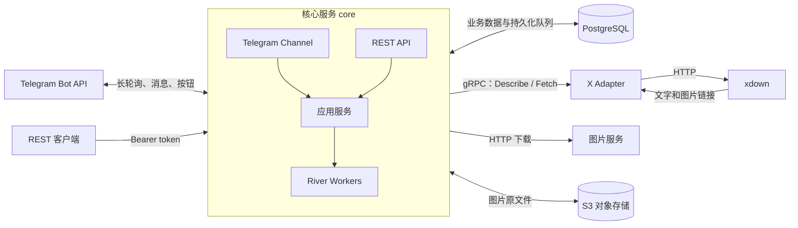
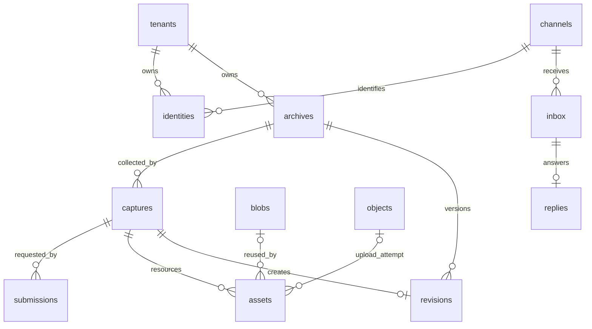

# 服务架构与数据库

## 服务组成

Monitor 由 Go 核心服务、独立 X Adapter、PostgreSQL 和 S3 兼容对象存储组成。Telegram 和 REST 是核心服务的两个入口，共用采集、归档、权限和额度逻辑。

| 组件           | 当前职责                                                              |
| -------------- | --------------------------------------------------------------------- |
| `core`         | Telegram 收发、REST、租户认证、任务调度、下载、去重、归档、额度与投递 |
| `adapter`      | 提供 gRPC 接口，识别 X 帖子并通过 xdown 获取文字和静态图片链接        |
| PostgreSQL     | 保存身份、归档、任务、资源索引、用量和 River 队列                     |
| S3             | 保存图片二进制；本地部署使用 SeaweedFS                                |
| `migrate`      | 一次性执行数据库迁移并配置业务数据库角色                              |
| `storage-init` | 本地对象存储初始化：创建 bucket 并验证访问                            |

Adapter 是运营者部署并认证的可信服务，Provider 和其返回的资源链接按可信输入处理。Adapter 不连接数据库或对象存储；核心负责下载和持久化。用户请求及按钮参数需要身份、权限、URL 范围和额度校验。

## 一次采集如何执行

1. Telegram 接收消息或按钮回调，根据 Bot 实例和外部用户 ID 解析租户。更新写入 `inbox` 并创建处理任务后，才推进轮询 offset。REST 通过 token 摘要解析租户。
2. 应用服务规范化帖子 URL，找到或创建 `archives`。已有归档可直接返回；同一归档进行中的采集合并到同一个 `captures`。
3. 每次用户提交生成独立 `submissions`，记录身份、会话和幂等键。多个提交可以共享一次采集，但分别向各自来源投递。
4. 采集 worker 调用 Adapter，保存文字、图片链接及来源信息，创建图片下载任务。
5. 下载 worker 预留存储额度，下载并校验图片，计算 SHA-256，上传 S3。相同租户内相同内容复用 Blob。
6. 资源全部到达终态后，归档 worker 生成内容 hash。内容有变化则写入新 `revisions`；无变化则复用原版本并更新观察时间。
7. 投递 worker 更新原状态消息，并发送归档图文。已确认的消息和图片批次进度写入数据库，供重试和重启后恢复。

核心使用 PostgreSQL 中的 River 队列，业务变更与任务入队在同一事务提交。远程 HTTP、gRPC 和 S3 请求不占用业务事务。

| River 队列 | 任务                         | 默认 worker 数 |
| ---------- | ---------------------------- | -------------- |
| `capture`  | 调用 Adapter 采集            | 4              |
| `download` | 下载图片、上传对象存储       | 8              |
| `control`  | 处理渠道更新、完成归档       | 4              |
| `delivery` | 状态更新、命令回复、图文投递 | 2              |

采集另外受每租户 2 个执行槽限制。下载受下载 worker 数限制。可重试失败最多执行 3 次；限流响应的 `Retry-After` 控制下一次重试时间。状态轮询使用 River 的延后执行机制，不消耗失败重试次数。

## 数据库关系

租户业务表都包含 `tenant_id`；图中省略了部分租户归属关系。UUID 用作内部 ID，平台对象 ID 和外部用户 ID 使用字符串。

### 身份与访问

| 表            | 作用与关键约束                                                                                                 |
| ------------- | -------------------------------------------------------------------------------------------------------------- |
| `tenants`     | 数据和额度归属。保存 `used_bytes`、`reserved_bytes`、`quota_bytes`，以及每分钟采集计数                         |
| `channels`    | Bot 等渠道实例。保存稳定 UUID、渠道类型、外部实例 ID 和 `next_offset`；`(kind, external_id)` 唯一              |
| `identities`  | 渠道用户与租户的绑定。`(channel_id, external_id)` 唯一；一个租户可有多个身份                                   |
| `tokens`      | REST token 的 SHA-256 摘要、租户和撤销状态                                                                     |
| `connections` | 已存在的账号接入模型：租户、Adapter、Provider、账号标识、状态和凭据引用；当前 xdown 采集不使用此表中的账号连接 |

首次 Telegram 私聊通过数据库函数 `resolve_identity` 创建个人租户与身份。事务锁保证并发首次访问不会创建多个绑定。不同渠道实例中的相同外部用户 ID 不会自动关联。

`channels` 是全局实例配置；`identities` 是租户数据。身份解析和 token 认证通过受限的数据库函数完成，之后的业务事务设置 `app.tenant_id`。

### 归档与采集

| 表            | 作用与关键约束                                                                                                              |
| ------------- | --------------------------------------------------------------------------------------------------------------------------- |
| `archives`    | 帖子的长期身份与当前版本指针。唯一键为租户、平台、访问作用域、对象类型、平台对象作用域、外部 ID                             |
| `captures`    | 一次采集执行，保存 Provider、Connection、状态、暂存内容、预留用量、错误和最终版本引用。同一租户同一归档最多一个进行中的采集 |
| `revisions`   | 内容版本。保存内容 hash、文字等 JSONB 内容、内容字节数及产生该版本的采集 ID                                                 |
| `submissions` | 一次提交及其投递。保存发起身份、渠道、会话、幂等键、状态消息 ID、状态文字和投递进度；`(tenant_id, idem_key)` 唯一           |

**归档是“这条帖子”，采集是“一次抓取”，提交是“谁请求了它”。** 因此多个渠道用户可以共享归档与采集结果，同时各自收到回复。重新抓取创建新的采集记录；只有内容变化才增加版本。

`captures.state` 包括 `queued`、`downloading`、`complete`、`partial`、`failed`。失败不删除旧版本，也不表示原帖已被删除。

`archives.current_revision` 指向当前版本，`captures.revision_id` 指向该次采集最终使用的版本。投递按后者读取，避免较晚的重新抓取改变此前提交的回传内容。

### 图片与对象

| 表        | 作用与关键约束                                                                  |
| --------- | ------------------------------------------------------------------------------- |
| `assets`  | 某次采集中的图片引用，保存顺序、来源 URL、下载状态、失败原因和 Blob／对象引用   |
| `blobs`   | 去重后的图片内容，保存 SHA-256、对象 key、大小和 MIME；`(tenant_id, hash)` 唯一 |
| `objects` | S3 对象的生命周期记录，状态为 `pending`、`attached`、`garbage` 或 `deleting`    |

图片字节放在 S3，PostgreSQL 保存索引和元数据。对象 key 形如 `<tenant_id>/objects/<object_id>`。

先记录待上传对象，再执行上传和落库。内容重复时复用已有 Blob，多余对象标记为垃圾；垃圾对象经过至少 24 小时后清理。这样可以处理上传成功但数据库提交前进程中断的情况。

旧版本通过 `revisions.capture_id` 找到对应 `assets`。图片顺序属于引用，内容 hash 属于 Blob；不同版本可以引用同一份图片。额度按租户内唯一 Blob 加上保存的版本内容计量，下载前预留、终态时结算或释放。

### 渠道与基础设施

| 表                | 作用                                                                         |
| ----------------- | ---------------------------------------------------------------------------- |
| `inbox`           | 持久化 Telegram 消息及按钮回调；`(channel_id, update_id)` 唯一，防止重复消费 |
| `replies`         | 命令回复的文本、按钮、消息 ID 和发送状态；每个 inbox 最多一条回复            |
| `schema_versions` | 应用 schema 版本标记；当前迁移通过可重复执行的 schema SQL 应用               |
| `river_*`         | River 管理的任务、队列、调度和迁移记录                                       |

业务租户表启用并强制执行 RLS，关联外键包含租户 ID，核心的 `monitor_app` 角色无超级用户、表所有者或 `BYPASSRLS` 权限。River 表是内部共享调度数据，由核心访问；用户通过业务 API 查询自己的任务。

## Telegram 消息处理

命令定义集中在 `internal/app/commands.go`。同一注册表驱动命令处理、参数校验、帮助文本、按钮回调校验及 SDK `setMyCommands`。启动时自动同步菜单。

消息 ID 和按钮写入数据库。状态更新与最终投递共享提交级锁，避免进度消息覆盖结果；从采集状态或已完成的归档消息打开菜单时，导航回复使用独立消息，保留归档内容；菜单及状态查询消息可以原地更新。文字分段、图片分组发送，图片发送失败时可回退为文件发送。

Telegram 投递采用至少一次语义：远端成功但响应丢失时可能重复展示，归档与额度更新保持幂等。

## 代码入口

- `cmd/core/main.go`：核心进程与依赖装配。
- `cmd/xadapter/main.go`：X Adapter 进程。
- `internal/app/`：业务服务、任务、命令和投递。
- `internal/telegram/`：Telegram SDK 封装。
- `internal/store/schema.sql`：表、约束、RLS 与身份解析函数。
- `api/adapter/v1/adapter.proto`：Adapter 协议。
- `internal/xdown/`：当前 X Provider 请求与解析。
