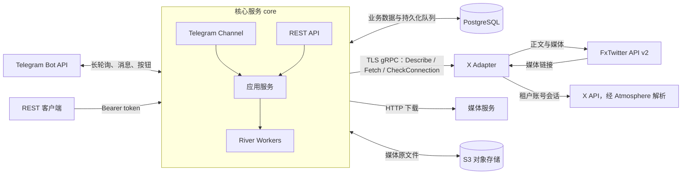
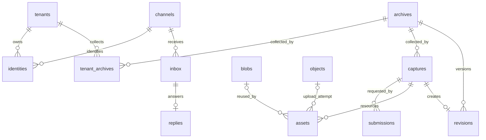

# 服务架构与数据库

## 服务组成

Monitor 由 Go 核心服务、独立 Node.js/TypeScript X Adapter、PostgreSQL 和 S3 兼容对象存储组成。Telegram 和 REST 是核心服务的两个入口，共用采集、归档、权限和额度逻辑。

| 组件           | 当前职责                                                              |
| -------------- | --------------------------------------------------------------------- |
| `core`         | Telegram 收发、REST、租户认证、任务调度、下载、去重、归档、额度与投递 |
| `adapter`      | 提供 gRPC 接口，识别 X 帖子，通过公共 FxTwitter API 或租户账号获取正文与媒体         |
| PostgreSQL     | 保存身份、归档、任务、资源索引、用量和 River 队列                     |
| S3             | 保存媒体二进制；本地部署使用 SeaweedFS                                |
| `migrate`      | 一次性执行数据库迁移并配置业务数据库角色                              |
| `storage-init` | 本地对象存储初始化：创建 bucket 并验证访问                            |

Adapter 是运营者部署并认证的可信服务，Provider 和其返回的资源链接按可信输入处理。Adapter 不连接数据库或对象存储；核心负责下载和持久化。用户请求及按钮参数需要身份、权限、URL 范围和额度校验。

`fxtwitter` Provider 直接调用 FxTwitter 公共实例的 `/2/status/{id}`，无需任何账号；可选 `x-session` Provider 使用指定租户的账号会话，经固定源码版本的 Atmosphere 请求并解析 X。Provider 选择持久化在任务中；归档记录来源和 adapter 版本。视频和 GIF 选择 最高分辨率、同分辨率最高码率的 MP4／WebM 下载；文章及缺失媒体会明确标记，限流和暂时不可用会重试。

## 内容可见性

Provider 在 `Describe` 中声明支持的 `visibilities`，由 `Fetch` 返回实际可见性。公共 API 只返回 public；账号任务在抓取前按租户、Connection 隔离，取得明确公开证据后才合并到公共归档，否则按 private 保存。刷新改变可见性时建立对应作用域的内容身份，成功后移动发起租户的保存引用，不改变其他租户的权限。刷新选择保存在 `tenant_archives`，共享归档不能成为借用其他租户凭据的入口。

`archives`、`captures`、`revisions`、`assets`、`blobs` 保存可见性，以及数据库生成的 `data_scope`：public 使用统一的全零 UUID，private 使用租户 UUID。因此公开内容在全局去重，私有内容只在同租户内去重，两者不复用版本或媒体。`tenant_id` 记录创建者，用于写入权限及对象生命周期管理，不决定保存者的额度计量。创建者和可见性创建后不可修改。

公开归档的当前版本指针全局共享，任意租户刷新成功后，所有保存者查看时得到新版本；已发送的 Telegram 内容消息不改写，也不向其他保存者广播。`tenant_archives` 记录各租户自己的保存记录。任务查询仅对执行租户或提交者开放。受限函数 `capture_deliveries` 让执行租户调度该任务各提交来源的投递，不开放其他租户的身份或会话数据。

对 `tenant_archives` 按 `archive_id` 计数可得到保存该归档的租户数；同租户不同渠道不会重复计算。全局统计需要管理员或受限统计入口，普通租户查询仍受 RLS 限制，目前没有公开保存人数 API。这里的投递指向提交者发送采集结果、文字和媒体，例如回复其 Telegram 私聊。

## 一次采集如何执行

1. Telegram 接收消息或按钮回调，根据 Bot 实例和外部用户 ID 解析租户。更新写入 `inbox` 并创建处理任务后，才推进轮询 offset。REST 通过 token 摘要解析租户。
2. 应用服务规范化帖子 URL，找到或创建 `archives`。已有归档可直接返回；同一归档进行中的采集合并到同一个 `captures`。
3. 每次用户提交生成独立 `submissions`，记录身份、会话和幂等键。多个提交可以共享一次采集，但分别向各自来源投递。
4. 采集 worker 调用 Adapter，保存文字、媒体链接及来源信息，创建媒体下载任务。
5. 下载 worker 预留存储额度，下载并校验媒体，计算 SHA-256，上传 S3。公开媒体跨租户复用 Blob；私有媒体仅在所属租户内复用。
6. 资源全部到达终态后，归档 worker 生成内容 hash。内容有变化则写入新 `revisions`；无变化则复用原版本并更新观察时间。
7. 投递 worker 对纯文字结果更新原状态消息；图文结果移除临时状态消息，以带说明的媒体或相册发送。已确认的消息和媒体批次进度写入数据库，供重试和重启后恢复。

核心使用 PostgreSQL 中的 River 队列，业务变更与任务入队在同一事务提交。远程 HTTP、gRPC 和 S3 请求不占用业务事务。

| River 队列 | 任务                         | 默认 worker 数 |
| ---------- | ---------------------------- | -------------- |
| `capture`  | 调用 Adapter 采集            | 4              |
| `download` | 下载媒体、上传对象存储       | 8              |
| `control`  | 处理渠道更新、完成归档       | 4              |
| `delivery` | 状态更新、命令回复、图文投递 | 2              |

采集另外受每租户 2 个执行槽、每 Connection 默认 1 个执行槽限制，分别由 `tenant_concurrency` 和 `connection_concurrency` 配置。下载受下载 worker 数限制。可重试失败最多执行 3 次；限流响应的 `Retry-After` 控制下一次重试时间。状态轮询使用 River 的延后执行机制，不消耗失败重试次数。

## 数据库关系

租户业务表都包含 `tenant_id`；图中省略了部分租户归属关系。UUID 用作内部 ID，平台对象 ID 和外部用户 ID 使用字符串。

### 身份与访问

| 表            | 作用与关键约束                                                                                              |
| ------------- | ----------------------------------------------------------------------------------------------------------- |
| `tenants`     | 租户及额度配置。保存 `reserved_bytes`、`quota_bytes` 和每分钟采集计数；实际用量从保存记录的引用计算               |
| `channels`    | Bot 等渠道实例。保存稳定 UUID、渠道类型、外部实例 ID 和 `next_offset`；`(kind, external_id)` 唯一           |
| `identities`  | 渠道用户与租户的绑定。`(channel_id, external_id)` 唯一；一个租户可有多个身份                                |
| `tokens`      | REST token 的 SHA-256 摘要、租户和撤销状态                                                                  |
| `connections` | 已存在的账号接入模型：租户、Adapter、Provider、账号标识、状态和凭据引用；个人账号由管理 CLI 导入、检查及撤销，凭据引用指向加密记录 |

首次 Telegram 私聊或群聊请求按发送者的 user ID，通过数据库函数 `resolve_identity` 创建个人租户与身份。事务锁保证并发首次访问不会创建多个绑定。不同渠道实例中的相同外部用户 ID 不会自动关联。群 ID 仅作为回复目的地，不作为身份。群内按钮操作还会校验原消息的发起身份，不能通过点击他人的按钮访问或更改其数据。「我也要存」是唯一例外：仅对公开归档添加当前点击者的 `tenant_archives` 引用，在租户锁和归档行锁内校验额度，不创建采集或提交记录，成功、重复和失败仅通过 callback toast 返回。

`channels` 是全局实例配置；`identities` 是租户数据。身份解析和 token 认证通过受限的数据库函数完成，之后的业务事务设置 `app.tenant_id`。

### 归档与采集

| 表                | 作用与关键约束                                                                                                                          |
| ----------------- | --------------------------------------------------------------------------------------------------------------------------------------- |
| `archives`        | 帖子的长期身份与当前版本指针。唯一键为数据共享边界、平台、访问作用域、对象类型、平台对象作用域、外部 ID                                 |
| `captures`        | 一次采集执行，保存 Provider、Connection、状态、暂存内容、预留用量、错误和最终版本引用。相同归档、Provider、Connection 最多一个进行中的采集；公共 Provider 跨租户合并，账号任务不跨 Connection 合并 |
| `revisions`       | 内容版本。保存内容 hash、文字等 JSONB 内容、内容字节数及产生该版本的采集 ID                                                             |
| `tenant_archives` | 租户独立的保存记录；`(tenant_id, archive_id)` 唯一，列表和游标按保存时间排序                                                            |
| `submissions`     | 一次提交及其投递。保存发起身份、渠道、会话、幂等键、状态消息 ID、状态文字和投递进度；`(tenant_id, idem_key)` 唯一                       |

**归档是“这条帖子”，采集是“一次抓取”，提交是“谁请求了它”。** 因此多个渠道用户可以共享归档与采集结果，同时各自收到回复。重新抓取创建新的采集记录；只有内容变化才增加版本。

`captures.state` 包括 `queued`、`downloading`、`complete`、`partial`、`failed`。失败不删除旧版本，也不表示原帖已被删除。

`archives.current_revision` 指向当前版本，`captures.revision_id` 指向该次采集最终使用的版本。投递按后者读取，避免较晚的重新抓取改变此前提交的回传内容。

### 媒体与对象

| 表        | 作用与关键约束                                                                   |
| --------- | -------------------------------------------------------------------------------- |
| `assets`  | 某次采集中的媒体引用，保存顺序、来源 URL、下载状态、失败原因和 Blob／对象引用    |
| `blobs`   | 去重后的媒体内容，保存 SHA-256、对象 key、大小和 MIME；`(data_scope, access_scope, hash)` 唯一 |
| `objects` | S3 对象的生命周期记录，状态为 `pending`、`attached`、`garbage` 或 `deleting`     |

媒体字节放在 S3，PostgreSQL 保存索引和元数据。对象 key 形如 `<tenant_id>/objects/<object_id>`。

先记录待上传对象，再执行上传和落库。内容重复时复用已有 Blob，多余对象标记为垃圾；垃圾对象超过 `config.object_gc_grace_hours` 指定的最小存活时间后清理（默认 24 小时）。这样可以处理上传成功但数据库提交前进程中断的情况。

资源下载完成后先计算 SHA-256，在同一可见性及访问作用域的 hash 锁下检查 Blob；已有内容直接复用，仅不存在时上传 S3。上传期间不持有数据库事务。上传成功但数据库提交中断的临时对象仍由延迟清理机制回收。不可变媒体缓存也按访问作用域隔离。

X 视频缓存键包含媒体 ID 和具体画质路径。X 头像仅对 `https://pbs.twimg.com/profile_images/<图片ID>/<文件名>` 生成完整 URL 缓存键，保留尺寸和查询参数；URL 相同则复用原文件，URL 改变重新下载并按 hash 去重。其他来源的头像不采用 URL 缓存。

旧版本通过 `revisions.capture_id` 找到对应 `assets`。媒体顺序属于引用，内容 hash 属于 Blob；不同版本可以引用同一份媒体。物理存储按 Blob 去重，租户用量按其保存记录的引用分别计算。

API 的 `used_bytes` 由 `tenant_usage()` 在当前租户 RLS 上下文中计算：已保存归档的全部历史版本内容字节数，加上这些版本引用的媒体按 SHA-256 去重后的字节数。版本大小按规范 JSON 序列化的字节数计算。`reserved_bytes` 是执行中任务的临时预留，已下载媒体保留实际新增引用的预留，直到归档终态统一释放。索引、队列、提交记录、备份及等待清理的重复上传对象不计入逻辑用量。

例如 A、B 都保存 10 MiB 媒体，两人的额度分别计入 10 MiB，S3 只存一份。A 删除后释放自己的额度，B 保持计量。删除一条保存记录不会释放仍被同租户其他保存记录引用的媒体。新增保存记录时，在同一事务中检查去重后的用量，不足则整体回滚。共享更新对所有保存者立即可见并计量；被动更新导致超额时保留内容，阻止新增保存与主动采集，允许读取和删除。

删除通过 `DELETE /v1/archives/{id}` 或 Telegram `/delete` 执行。最后一个引用删除时记录 `unreferenced_at`。维护任务在 `config.archive_retention_days` 天后（默认 7 天）锁定并检查归档，无保存记录、在途采集或待发送结果时删除内容索引；只有没有其他资源引用的 Blob 才转入对象垃圾清理。重新保存会清除清理标记。保存、用量检查和删除使用租户锁；内容清理与重新保存使用同一归档行锁。

### 渠道与基础设施

| 表                | 作用                                                                                         |
| ----------------- | -------------------------------------------------------------------------------------------- |
| `inbox`           | 持久化 Telegram 消息及按钮回调；`(channel_id, update_id)` 唯一，防止重复消费                 |
| `replies`         | 命令回复的文本、按钮、消息 ID 和发送状态；每个 inbox 最多一条回复                            |
| `config`          | 全局运行参数和服务凭据，保存键、文本值、值类型、敏感标记和更新时间；管理员写入，业务角色只读 |
| `schema_versions` | 应用 schema 版本标记，发布前保持 `1`                               |
| `schema_migrations` | 已执行迁移的文件名、校验和与执行时间；管理员访问 |
| `river_*`         | River 管理的任务、队列、调度和迁移记录                                                       |

业务表启用并强制执行 RLS。身份、Connection、保存记录、提交与消息按租户隔离；内容允许已认证租户读取 public 数据，private 数据仅允许所属租户读取。内容关联外键使用 `data_scope`，渠道及账号关联外键使用 `tenant_id`。核心的 `monitor_app` 角色无超级用户、表所有者或 `BYPASSRLS` 权限。River 表是内部共享调度数据，由核心访问；用户通过业务 API 查询自己的任务。

## Telegram 消息处理

群聊的触发消息 ID 持久化在 `submissions.reply_to_message_id` 和 `replies.reply_to_message_id`。发送文字、媒体、媒体组或文件回退时均带回复目标，进度编辑保留已有回复关系。按钮操作在群内新发消息，并回复被点击的 Bot 消息。

命令定义集中在 `internal/app/commands.go`。同一注册表驱动命令处理、参数校验、帮助文本、按钮回调校验及 SDK `setMyCommands`。启动时自动同步菜单。

消息 ID 和按钮写入数据库。状态更新与最终投递共享提交级锁，避免进度消息覆盖结果；从采集状态或已完成的归档消息打开菜单时，导航回复使用独立消息，保留归档内容；菜单及状态查询消息可以原地更新。正文优先放入首图说明，限制为 1,024 个 UTF-16 单位；媒体每组最多 10 张，所有媒体批次先于溢出文字发送。媒体发送失败时可回退为文件，保留说明与回复目标。相册发送、按钮设置和溢出文字分别记录进度，按钮设置失败后重试不会重发已确认的相册。

Telegram 投递采用至少一次语义：远端成功但响应丢失时可能重复展示，归档与额度更新保持幂等。

## 代码入口

- `cmd/core/main.go`：核心进程与依赖装配。
- `adapters/x/src/server.ts`：TS X Adapter 进程。
- `internal/app/`：业务服务、任务、命令和投递。
- `internal/telegram/`：Telegram SDK 封装。
- `internal/store/migrations/0001_initial.sql`：表、约束、RLS 与身份解析函数。
- `api/adapter/v1/adapter.proto`：Adapter 协议。
- `adapters/x/src/session.ts`：租户账号 transport 与结果可见性判定。
- `adapters/x/src/`：公共 API 与个人账号 Provider；`third_party/atmosphere/`：固定上游版本的本地源码依赖。

媒体引用保存 `kind`、`alt_text` 和 `cache_key`。缓存键由平台、最终访问作用域及不可变媒体标识组成；公开资源可跨 Provider 共享，私有作用域包含 Connection，在 `data_scope` 内查找；标识包含媒体 ID 与文件规格。下载使用媒体级锁合并并发请求，命中缓存后复用 Blob 并按当前租户引用结算额度。媒体描述计入版本内容大小及变化比较，描述变化不会触发视频重新下载。缓存随媒体引用的保留和清理生命周期释放。

群聊普通消息在入库和身份解析前检查 Telegram 的 mention／bot_command 实体，只有明确指向当前 Bot 用户名的消息才进入处理；图片说明中的 @ 同样适用。按钮回调沿用原权限规则，不要求再次 @。用户名通过启动时的 getMe 获取。

`channel_media_cache` 是通用渠道传输缓存，以 `(channel_kind, account_id, hash, representation)` 标识远端媒体引用 `remote_id`。这些值由渠道集成解释，归档和 Blob 不依赖 Telegram；缓存不是内容授权依据，发送前仍使用当前用户可访问的归档。Telegram 按 Bot ID 复用 `file_id`，并区分 photo、video、document。仅明确失效的引用会被条件删除并重新上传，429 等暂时错误不会清除缓存；成功发送后的缓存写入失败也不会重发消息。

媒体引用上的 `sensitive` 由 Adapter 返回并计入版本比较。FxTwitter 的帖子敏感标记应用到全部媒体；Telegram 每次发送（含缓存命中）都使用当前引用的标记设置 `has_spoiler`。缓存键不包含敏感标记，改变展示标记无需重新上传。document 文件正常发送，不设置 spoiler；图片和视频发送失败时仍可回退为文件。

## 账号执行与凭据

`account_credentials` 保存 AES-GCM 密文，AAD 绑定租户和凭据记录 ID；`tenant_preferences` 以 `(tenant_id, adapter_id)` 为主键，分别保存每个 Adapter 的默认 Connection，并用包含租户和 Adapter 的外键约束账号归属。两张表均强制 RLS。主密钥由部署环境或 secret 文件提供，不写入数据库。

核心解密后通过认证 TLS RPC 临时传递凭据。Adapter 不保存租户会话，不使用账号池，不匿名降级；公开 API 请求不携带账号凭据。任务记录 Provider、Connection 及实际执行的凭据修订号，执行和最终提交均校验状态；凭据替换或撤销使旧执行不能提交结果。认证失效标记 `reauth_required`，限流和临时上游故障不改变认证状态。

个人账号导入需验证会话；验证失败不会替换已保存凭据。撤销会删除不再引用的加密凭据，但保留 Connection 的任务审计关联。新账号功能的真实受保护帖子访问需要使用已授权的测试账号完成验证。

## Adapter 协议与能力发现

`adapter.v1` 使用 `major.minor` 协议版本，当前为 `1.0`，与 Adapter 软件版本独立。核心拒绝不同 major；同 major 的 minor 只能增加可选字段和操作，旧客户端忽略未知字段。发布后改变已有字段含义、删除字段或改变现有操作语义需要新的 major 和 protobuf package。发布前不保留旧协议的兼容分支。

`Describe` 是唯一必需的业务 RPC；标准 gRPC health 用于部署健康检查。核心握手不限定平台 ID，也不要求支持采集、账号或某一种媒体。每个 Provider 独立声明 `capabilities`，每项含 `name`、`major`、`minor`：

| 能力 | 当前版本 | 含义 |
| --- | --- | --- |
| `capture.fetch` | 1.0 | 用 `Resolve` 规范化 URL，再用 `Fetch` 读取单个目标 |
| `capture.related` | 1.0 | 返回关联目标及最小刷新间隔；核心按提交者身份持久化执行一层关联采集 |
| `capture.canonical` | 1.0 | Fetch 返回同平台、同类型的稳定目标身份 |
| `credential.prepare` | 1.0 | 用 `PrepareCredential` 将用户输入转换为 Adapter 私有的凭据格式 |
| `connection.check` | 1.0 | 用 `CheckConnection` 验证账号会话 |
| `content.text` | 1.0 | 采集结果可以包含文字 |
| `entity.graph` | 1.0 | 返回由 Adapter 声明结构的实体及关系 |
| `source.raw` | 1.0 | 完整上游响应体及其可见性 |
| `media.image` | 1.0 | 采集结果可以包含图片 |
| `media.video` | 1.0 | 采集结果可以包含视频 |

能力表示 Provider 可以提供的功能，不保证每次结果包含所有媒体。实际归档内容仍以 Fetch 返回的数据为准。公共 FxTwitter Provider 不声明账号验证能力；个人账号 Provider 声明该能力。采集 Provider 同时声明允许的可见性，实际结果仍须遵守公私隔离规则。

调用方按能力名称、相同 major、满足最低要求的 minor 选择操作；未知能力或未知能力 major 不阻止握手，也不会自动启用操作。一个能力 major 只能声明一次，需要支持多个 major 时分别声明。缺少操作能力时核心在提交或发送凭据前拒绝请求。声明了能力但实际返回 `UNIMPLEMENTED` 属于契约错误，按永久失败处理，不切换 Provider。

未来检索、批量读取、流式订阅分别增加 RPC 和独立能力声明，现有 Adapter 无须实现。新操作的权限范围、分页或批量上限、流的取消与背压、断线恢复游标需随该操作的契约一起定义；不能仅增加能力名称就视为支持。Go Adapter 可嵌入 `UnimplementedAdapterServer`；TypeScript 实现使用 `satisfies Pick<AdapterServer, "describe"> & Partial<AdapterServer>`，缺少的方法由 gRPC 返回 `UNIMPLEMENTED`。核心通过 Adapter 的 `Resolve` 获得平台、实体类型、对象作用域、字符串 ID 和规范化 URL，不解析平台 URL。核心可同时连接多个 Adapter，按 Describe 声明的 host 路由 URL；重复 Adapter ID 和重叠 host 配置在启动时拒绝。账号选择以租户和 Adapter 为联合键，各平台独立生效。任务持久保存 Adapter ID，重试不重新路由；Provider ID 只在所属 Adapter 内解释。

Adapter 在 `Describe.display_name` 声明展示名称；未提供名称时显示其 ID。界面不维护平台 ID 与名称的映射。

Provider 通过 `default_provider` 声明各认证模式的默认选择，同一认证模式只能有一个默认项。任务和 Connection 保存实际 Provider，执行时校验 Adapter 归属及能力，不隐式替换。凭据格式说明由 `credential_help` 提供。Telegram 可提供 X 专属交互；账号命令菜单按 Adapter 能力启用。

Describe 声明在核心启动时验证并缓存，能力变化需重启核心重新发现；管理 CLI 每次操作重新发现。滚动升级应先部署提供兼容旧能力的 Adapter，再升级核心，最后停用旧能力；跨 major 升级需并行部署对应版本端点。

Telegram `/account_add` 在接收阶段将凭据输入使用租户绑定的加密密文暂存于 inbox；处理阶段通过 TLS 调用 Adapter 的 `PrepareCredential` 解析并规范化。Go 核心只处理不透明字节、加密和归属校验，不解析 Cookie 字段；原始消息文字和实体在持久化前移除。队列只保存 inbox ID。处理完成或终止失败时清理暂存密文；验证通过后的长期凭据仍存放在 `account_credentials`。Connection ID 由渠道实例和 update ID 稳定生成，重复执行不会重新创建账号或恢复已撤销凭据。

账号添加采用私聊交互：选择平台后，`account_dialogs` 按租户、渠道身份和会话保存平台及 10 分钟期限。下一条非命令文本作为不透明凭据加密进入 inbox，原文不落库；取消、超时或提交结束会清理对应交互。数据库状态使核心重启后仍可继续输入。

X 账号验证使用携带该账号 Cookie 的 `Viewer` GraphQL 接口，从当前会话返回的用户实体确认账号 ID 和用户名。普通帖子和 Profile 查询直接请求 API，不依赖登录首页或请求签名。只有上游签名清单中的接口才使用该账号首页初始化签名，账号页面不进入共享缓存。浏览器验证挑战、认证拒绝、受限会话、响应结构变化和上游临时故障分别处理；未知响应不视为验证成功，也不会自动回退为访客或其他账号。

## 数据库迁移

`schema_migrations` 保存有序迁移文件名、SHA-256 校验和及执行时间，仅管理员访问。迁移进程持有 PostgreSQL advisory lock，先校验全部已执行历史，再按顺序应用未执行文件；每个文件的 SQL 和执行记录在同一事务内提交。完整初始结构只执行一次，后续通过独立迁移变更结构和数据。River 维护自己的迁移记录，与应用 schema 版本独立；应用迁移和 River 升级均成功后才允许启动核心。

## Adapter 定义的实体与原始响应

Adapter 的 `Describe.entity_types` 提供类型名与自包含 JSON Schema 2020-12。Provider 通过 `entity.graph` capability 和 `entity_types` 列表声明所支持的类型。核心在发现阶段编译 Schema，在采集阶段校验实体数据、根节点、关系端点和资源索引；未声明的类型或不符合 Schema 的数据不会入库。协议保持 `1.0`、应用 schema 保持 `1`。类型结构变化通过各版本保存的 Schema 快照区分，不由公共 proto 定义平台字段。

`Fetch.graph` 包含 root、entities、relations。每个实体有图内 key、类型、外部 ID、JSON data 和资源索引；关系使用图内 key 与 Adapter 定义的关系名称。整张图继承采集结果的可见性与访问作用域，不能从图内引用其他租户或作用域的已有实体。资源的 purpose 由 Adapter 定义：空值表示加入通用展示，其余作为实体关联资源保存。核心只认识通用媒体类型，不解释 avatar 等角色。

`entities` 以平台、访问作用域、类型和外部 ID 标识对象，公共实体跨租户共享，私有实体按租户隔离。`entity_versions` 保存数据、Schema 快照与内容哈希；实际资源内容参与版本比较。`revision_entities` 将归档版本关联到当时的实体版本，并标记根节点；`entity_relations` 保存该次快照的关系，端点外键包含数据作用域。`GET /v1/entities/{id}` 读取调用租户所保存归档关联的最新实体快照；归档 API 内的 graph 固定关联当时版本。

X Adapter 在 `adapters/x/src/entity-schemas.ts` 定义 `x.post` 和 `x.profile`，通过 `authored_by` 关联。帖子 data 包含正文、上游发布时间、编辑时间及来源、编辑 ID 列表；Profile data 包含用户名、昵称、头像 URL 与个人资料。头像文件由 Adapter 作为关联资源返回，核心下载保存，不加入 Telegram 帖子相册。编辑时间优先采用上游明确字段，否则在存在多个编辑版本 ID 时从最新 Snowflake 推导并标记 `x_snowflake`；没有证据时省略。

Fetch 的 text、text_kind、summary、author_name、published_at 和展示媒体是可选的通用展示字段，与 entity data 分开。summary 由 Adapter 提供；X Adapter 使用“作者名：内容”，并按帖子媒体顺序追加 `[图片]`、`[视频]`，不包括作者头像。Telegram 列表将换行合并为空格，每条最多显示 100 个字符，超出用省略号收尾并保留媒体标记，条目间留空行。列表摘要以文本链接指向归档的来源 URL。每行按钮并排提供查看归档和查看原帖。详情展示归档 ID、作者、正文和原始发布时间，来源通过原帖按钮打开；时间转换为 UTC+8，未知时间省略。Telegram 只读取这些字段，不解析 X 或其他平台的专属 JSON。正文和摘要在同一归档版本中保存。

`source_responses` 保留采集接口响应体的原始字节、内容类型、请求地址、哈希、大小和采集记录关联，不保存请求 Cookie、认证头或登录首页。每次成功采集都保存原始响应，即使实体内容没有变化；原始响应变化不会单独创建内容版本。账号接口的原始响应强制为私有，不能随公开帖子向其他租户共享。其读取需要原始采集租户仍保存该帖子；删除后独立进入保留期，即使公开帖子仍被其他租户持有，也能回收该私有响应。

逻辑额度包含归档版本序列化内容（包括 entity data、Schema 快照和关系）、唯一媒体文件和可访问的原始响应字节。实体索引表不重复收费；数据库索引、队列等运行开销不计入。原始响应单次合计上限 4 MiB，完整响应过大时明确失败，不静默截断。

`20260928000000_adapter_entities.sql` 将既有帖子与 Profile 快照转换为通用实体，保留归档及作者实体 ID、内容历史、资源和原始响应，转换执行中的采集快照并调整预留用量。旧 Profile 专用表转换后删除，运行代码不保留旧协议或数据格式分支；初始迁移的内容和校验和不变。

采集提交分别保留用户输入的原始链接（包括参数），不会因 URL 规范化或任务合并而覆盖。Telegram 失败通知使用对应提交的输入；旧提交优先从尚存的 inbox 恢复，无法恢复时使用归档来源 URL。较长的命令回复分段发送并持久化进度。账号采集使用私有暂存身份，但刷新已有归档不会把暂存身份自动加入保存列表；结果可见性确定后才关联最终归档。

账号以租户、Adapter、Provider 和上游验证返回的账号 ID 去重。重复添加替换凭据、刷新 handle 并递增凭据版本，保留 Connection ID 和当前选择。`connection_imports` 记录渠道导入请求的结果，队列重试不重复覆盖凭据，也不恢复已撤销账号。

### 关联目标和 Profile 采集

`Resolve.refresh_on_submit` 表示显式提交需要重新观察目标。`Fetch.canonical_target` 将用户名等临时定位方式归一为稳定身份；根实体 ID 对应最终身份。`Fetch.related_targets` 返回关联 URL 和 `refresh_after_seconds`，正值表示完成观察超过间隔后才刷新，零表示复用已有归档。Go 核心不解释平台路径或 Profile 字段。

每次显式提交都持久化一个关联任务及提交者的 Adapter、Provider、Connection。主采集完成后，任务在该租户上下文中逐一创建幂等子提交，共享主采集的其他租户使用各自的账号选择。子提交设置 `automatic`，不继续展开关联目标、不生成渠道投递；限流时延后执行，错误记录在提交的 `related_state` 和 `related_error`。每页最多接受 200 个关联目标，超限拒绝整页而非静默截断。

X Adapter 支持帖子、用户名 Profile URL 和稳定用户 ID Profile URL。帖子返回作者 Profile 的关联目标，刷新间隔为 60 秒；Profile 显式提交始终重新读取资料并读取时间线首批响应，将其中所有帖子声明为关联目标，不请求下一页。公开账号使用公共实例，count=100；受保护账号使用所选采集账号，count=20。自动 Profile 采集只读取资料。Profile 资料始终使用 FxTwitter 公共 API，包括 protected 账号；即使用户选择了账号，公开帖文仍使用公共 API，只有受保护帖文使用该 Connection 的 Cookie。完整响应体保存在 `source_responses`，账号原始数据不随公开资料共享。Profile 头像和封面作为实体关联资源保存。
