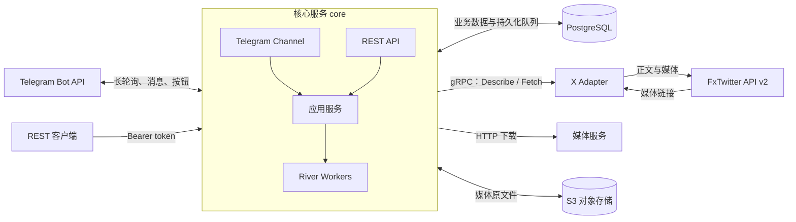
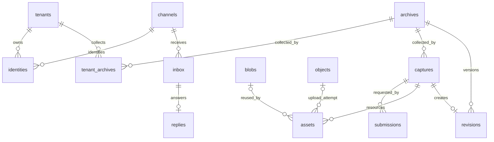

# 服务架构与数据库

## 服务组成

Monitor 由 Go 核心服务、独立 X Adapter、PostgreSQL 和 S3 兼容对象存储组成。Telegram 和 REST 是核心服务的两个入口，共用采集、归档、权限和额度逻辑。

| 组件           | 当前职责                                                              |
| -------------- | --------------------------------------------------------------------- |
| `core`         | Telegram 收发、REST、租户认证、任务调度、下载、去重、归档、额度与投递 |
| `adapter`      | 提供 gRPC 接口，识别 X 帖子，通过 FxTwitter API v2 获取正文与媒体         |
| PostgreSQL     | 保存身份、归档、任务、资源索引、用量和 River 队列                     |
| S3             | 保存媒体二进制；本地部署使用 SeaweedFS                                |
| `migrate`      | 一次性执行数据库迁移并配置业务数据库角色                              |
| `storage-init` | 本地对象存储初始化：创建 bucket 并验证访问                            |

Adapter 是运营者部署并认证的可信服务，Provider 和其返回的资源链接按可信输入处理。Adapter 不连接数据库或对象存储；核心负责下载和持久化。用户请求及按钮参数需要身份、权限、URL 范围和额度校验。

当前 X Adapter 使用 `fxtwitter` Provider，通过 `/2/status/{id}` 获取正文及有序媒体列表。Provider 选择持久化在任务中；归档记录来源和 adapter 版本。视频和 GIF 选择 最高分辨率、同分辨率最高码率的 MP4／WebM 下载；文章及缺失媒体会明确标记，限流和暂时不可用会重试。

## 内容可见性

Provider 在 `Describe` 中声明 `visibility`（public/private），`Fetch` 响应必须与已创建任务的可见性一致。未声明或不一致时拒绝保存；用户请求不能指定可见性。当前 FxTwitter 图文 Provider 声明 public。刷新沿用归档原本的 Provider 和可见性，不会自动改变共享范围。

`archives`、`captures`、`revisions`、`assets`、`blobs` 保存可见性，以及数据库生成的 `data_scope`：public 使用统一的全零 UUID，private 使用租户 UUID。因此公开内容在全局去重，私有内容只在同租户内去重，两者不复用版本或媒体。`tenant_id` 记录创建者，用于写入权限及对象生命周期管理，不决定保存者的额度计量。创建者和可见性创建后不可修改。

公开归档的当前版本指针全局共享，任意租户刷新成功后，所有保存者查看时得到新版本；已发送的 Telegram 内容消息不改写，也不向其他保存者广播。`tenant_archives` 记录各租户自己的保存记录。任务查询仅对执行租户或提交者开放。受限函数 `capture_deliveries` 让执行租户调度该任务各提交来源的投递，不开放其他租户的身份或会话数据。

对 `tenant_archives` 按 `archive_id` 计数可得到保存该归档的租户数；同租户不同渠道不会重复计算。全局统计需要管理员或受限统计入口，普通租户查询仍受 RLS 限制，目前没有公开保存人数 API。这里的投递指向提交者发送采集结果、文字和媒体，例如回复其 Telegram 私聊。

## 一次采集如何执行

1. Telegram 接收消息或按钮回调，根据 Bot 实例和外部用户 ID 解析租户。更新写入 `inbox` 并创建处理任务后，才推进轮询 offset。REST 通过 token 摘要解析租户。
2. 应用服务规范化帖子 URL，找到或创建 `archives`。已有归档可直接返回；同一归档进行中的采集合并到同一个 `captures`。
3. 每次用户提交生成独立 `submissions`，记录身份、会话和幂等键。多个提交可以共享一次采集，但分别向各自来源投递。
4. 采集 worker 调用 Adapter，保存文字、媒体链接及来源信息，创建媒体下载任务。
5. 下载 worker 预留存储额度，下载并校验媒体，计算 SHA-256，上传 S3。公开媒体跨租户复用 Blob；私有媒体仅在所属租户内复用。
6. 资源全部到达终态后，归档 worker 生成内容 hash。内容有变化则写入新 `revisions`；无变化则复用原版本并更新观察时间。
7. 投递 worker 对纯文字结果更新原状态消息；图文结果移除临时状态消息，以带说明的媒体或相册发送。已确认的消息和媒体批次进度写入数据库，供重试和重启后恢复。

核心使用 PostgreSQL 中的 River 队列，业务变更与任务入队在同一事务提交。远程 HTTP、gRPC 和 S3 请求不占用业务事务。

| River 队列 | 任务                         | 默认 worker 数 |
| ---------- | ---------------------------- | -------------- |
| `capture`  | 调用 Adapter 采集            | 4              |
| `download` | 下载媒体、上传对象存储       | 8              |
| `control`  | 处理渠道更新、完成归档       | 4              |
| `delivery` | 状态更新、命令回复、图文投递 | 2              |

采集另外受每租户 2 个执行槽限制。下载受下载 worker 数限制。可重试失败最多执行 3 次；限流响应的 `Retry-After` 控制下一次重试时间。状态轮询使用 River 的延后执行机制，不消耗失败重试次数。

## 数据库关系

租户业务表都包含 `tenant_id`；图中省略了部分租户归属关系。UUID 用作内部 ID，平台对象 ID 和外部用户 ID 使用字符串。

### 身份与访问

| 表            | 作用与关键约束                                                                                              |
| ------------- | ----------------------------------------------------------------------------------------------------------- |
| `tenants`     | 租户及额度配置。保存 `reserved_bytes`、`quota_bytes` 和每分钟采集计数；实际用量从保存记录的引用计算               |
| `channels`    | Bot 等渠道实例。保存稳定 UUID、渠道类型、外部实例 ID 和 `next_offset`；`(kind, external_id)` 唯一           |
| `identities`  | 渠道用户与租户的绑定。`(channel_id, external_id)` 唯一；一个租户可有多个身份                                |
| `tokens`      | REST token 的 SHA-256 摘要、租户和撤销状态                                                                  |
| `connections` | 已存在的账号接入模型：租户、Adapter、Provider、账号标识、状态和凭据引用；当前公开采集不使用此表中的账号连接 |

首次 Telegram 私聊或群聊请求按发送者的 user ID，通过数据库函数 `resolve_identity` 创建个人租户与身份。事务锁保证并发首次访问不会创建多个绑定。不同渠道实例中的相同外部用户 ID 不会自动关联。群 ID 仅作为回复目的地，不作为身份。群内按钮操作还会校验原消息的发起身份，不能通过点击他人的按钮访问或更改其数据。「我也要存」是唯一例外：仅对公开归档添加当前点击者的 `tenant_archives` 引用，在租户锁和归档行锁内校验额度，不创建采集或提交记录，成功、重复和失败仅通过 callback toast 返回。

`channels` 是全局实例配置；`identities` 是租户数据。身份解析和 token 认证通过受限的数据库函数完成，之后的业务事务设置 `app.tenant_id`。

### 归档与采集

| 表                | 作用与关键约束                                                                                                                          |
| ----------------- | --------------------------------------------------------------------------------------------------------------------------------------- |
| `archives`        | 帖子的长期身份与当前版本指针。唯一键为数据共享边界、平台、访问作用域、对象类型、平台对象作用域、外部 ID                                 |
| `captures`        | 一次采集执行，保存 Provider、Connection、状态、暂存内容、预留用量、错误和最终版本引用。同一归档最多一个进行中的采集，公开归档跨租户合并 |
| `revisions`       | 内容版本。保存内容 hash、文字等 JSONB 内容、内容字节数及产生该版本的采集 ID                                                             |
| `tenant_archives` | 租户独立的保存记录；`(tenant_id, archive_id)` 唯一，列表和游标按保存时间排序                                                            |
| `submissions`     | 一次提交及其投递。保存发起身份、渠道、会话、幂等键、状态消息 ID、状态文字和投递进度；`(tenant_id, idem_key)` 唯一                       |

**归档是“这条帖子”，采集是“一次抓取”，提交是“谁请求了它”。** 因此多个渠道用户可以共享归档与采集结果，同时各自收到回复。重新抓取创建新的采集记录；只有内容变化才增加版本。

`captures.state` 包括 `queued`、`downloading`、`complete`、`partial`、`failed`。失败不删除旧版本，也不表示原帖已被删除。

`archives.current_revision` 指向当前版本，`captures.revision_id` 指向该次采集最终使用的版本。投递按后者读取，避免较晚的重新抓取改变此前提交的回传内容。

### 媒体与对象

| 表        | 作用与关键约束                                                                   |
| --------- | -------------------------------------------------------------------------------- |
| `assets`  | 某次采集中的媒体引用，保存顺序、来源 URL、下载状态、失败原因和 Blob／对象引用    |
| `blobs`   | 去重后的媒体内容，保存 SHA-256、对象 key、大小和 MIME；`(data_scope, hash)` 唯一 |
| `objects` | S3 对象的生命周期记录，状态为 `pending`、`attached`、`garbage` 或 `deleting`     |

媒体字节放在 S3，PostgreSQL 保存索引和元数据。对象 key 形如 `<tenant_id>/objects/<object_id>`。

先记录待上传对象，再执行上传和落库。内容重复时复用已有 Blob，多余对象标记为垃圾；垃圾对象超过 `config.object_gc_grace_hours` 指定的最小存活时间后清理（默认 24 小时）。这样可以处理上传成功但数据库提交前进程中断的情况。

旧版本通过 `revisions.capture_id` 找到对应 `assets`。媒体顺序属于引用，内容 hash 属于 Blob；不同版本可以引用同一份媒体。物理存储按 Blob 去重，租户用量按其保存记录的引用分别计算。

API 的 `used_bytes` 由 `tenant_usage()` 在当前租户 RLS 上下文中计算：已保存归档的全部历史版本内容字节数，加上这些版本引用的媒体按 SHA-256 去重后的字节数。版本大小按规范 JSON 序列化的字节数计算。`reserved_bytes` 是执行中任务的临时预留，已下载媒体保留实际新增引用的预留，直到归档终态统一释放。索引、队列、提交记录、备份及等待清理的重复上传对象不计入逻辑用量。

例如 A、B 都保存 10 MiB 媒体，两人的额度分别计入 10 MiB，S3 只存一份。A 删除后释放自己的额度，B 保持计量。删除一条保存记录不会释放仍被同租户其他保存记录引用的媒体。新增保存记录时，在同一事务中检查去重后的用量，不足则整体回滚。共享更新对所有保存者立即可见并计量；被动更新导致超额时保留内容，阻止新增保存与主动采集，允许读取和删除。

删除通过 `DELETE /v1/archives/{id}` 或 Telegram `/delete` 执行。最后一个引用删除时记录 `unreferenced_at`。维护任务在 `config.archive_retention_days` 天后（默认 7 天）锁定并检查归档，无保存记录、在途采集或待发送结果时删除内容索引；只有没有其他资源引用的 Blob 才转入对象垃圾清理。重新保存会清除清理标记。保存、用量检查和删除使用租户锁；内容清理与重新保存使用同一归档行锁。

### 渠道与基础设施

| 表                | 作用                                                                                         |
| ----------------- | -------------------------------------------------------------------------------------------- |
| `inbox`           | 持久化 Telegram 消息及按钮回调；`(channel_id, update_id)` 唯一，防止重复消费                 |
| `replies`         | 命令回复的文本、按钮、消息 ID 和发送状态；每个 inbox 最多一条回复                            |
| `config`          | 全局运行参数和服务凭据，保存键、文本值、值类型、敏感标记和更新时间；管理员写入，业务角色只读 |
| `schema_versions` | 应用 schema 版本标记；当前迁移通过可重复执行的 schema SQL 应用                               |
| `river_*`         | River 管理的任务、队列、调度和迁移记录                                                       |

业务表启用并强制执行 RLS。身份、Connection、保存记录、提交与消息按租户隔离；内容允许已认证租户读取 public 数据，private 数据仅允许所属租户读取。内容关联外键使用 `data_scope`，渠道及账号关联外键使用 `tenant_id`。核心的 `monitor_app` 角色无超级用户、表所有者或 `BYPASSRLS` 权限。River 表是内部共享调度数据，由核心访问；用户通过业务 API 查询自己的任务。

## Telegram 消息处理

群聊的触发消息 ID 持久化在 `submissions.reply_to_message_id` 和 `replies.reply_to_message_id`。发送文字、媒体、媒体组或文件回退时均带回复目标，进度编辑保留已有回复关系。按钮操作在群内新发消息，并回复被点击的 Bot 消息。

命令定义集中在 `internal/app/commands.go`。同一注册表驱动命令处理、参数校验、帮助文本、按钮回调校验及 SDK `setMyCommands`。启动时自动同步菜单。

消息 ID 和按钮写入数据库。状态更新与最终投递共享提交级锁，避免进度消息覆盖结果；从采集状态或已完成的归档消息打开菜单时，导航回复使用独立消息，保留归档内容；菜单及状态查询消息可以原地更新。正文优先放入首图说明，限制为 1,024 个 UTF-16 单位；媒体每组最多 10 张，所有媒体批次先于溢出文字发送。媒体发送失败时可回退为文件，保留说明与回复目标。相册发送、按钮设置和溢出文字分别记录进度，按钮设置失败后重试不会重发已确认的相册。

Telegram 投递采用至少一次语义：远端成功但响应丢失时可能重复展示，归档与额度更新保持幂等。

## 代码入口

- `cmd/core/main.go`：核心进程与依赖装配。
- `cmd/xadapter/main.go`：X Adapter 进程。
- `internal/app/`：业务服务、任务、命令和投递。
- `internal/telegram/`：Telegram SDK 封装。
- `internal/store/schema.sql`：表、约束、RLS 与身份解析函数。
- `api/adapter/v1/adapter.proto`：Adapter 协议。
- `internal/xadapter/`：X 图文采集结果整合。
- `internal/fxtwitter/`：FxTwitter API v2 请求与图文解析。

媒体引用保存 `kind`、`alt_text` 和 `cache_key`。缓存键由平台、Provider、访问作用域、Connection 及 Provider 的不可变媒体标识组成，在 `data_scope` 内查找；标识包含媒体 ID 与文件规格。下载使用媒体级锁合并并发请求，命中缓存后复用 Blob 并按当前租户引用结算额度。媒体描述计入版本内容大小及变化比较，描述变化不会触发视频重新下载。缓存随媒体引用的保留和清理生命周期释放。

群聊普通消息在入库和身份解析前检查 Telegram 的 mention／bot_command 实体，只有明确指向当前 Bot 用户名的消息才进入处理；图片说明中的 @ 同样适用。按钮回调沿用原权限规则，不要求再次 @。用户名通过启动时的 getMe 获取。

`channel_media_cache` 是通用渠道传输缓存，以 `(channel_kind, account_id, hash, representation)` 标识远端媒体引用 `remote_id`。这些值由渠道集成解释，归档和 Blob 不依赖 Telegram；缓存不是内容授权依据，发送前仍使用当前用户可访问的归档。Telegram 按 Bot ID 复用 `file_id`，并区分 photo、video、document。仅明确失效的引用会被条件删除并重新上传，429 等暂时错误不会清除缓存；成功发送后的缓存写入失败也不会重发消息。

媒体引用上的 `sensitive` 由 Adapter 返回并计入版本比较。FxTwitter 的帖子敏感标记应用到全部媒体；Telegram 每次发送（含缓存命中）都使用当前引用的标记设置 `has_spoiler`。缓存键不包含敏感标记，改变展示标记无需重新上传。document 文件正常发送，不设置 spoiler；图片和视频发送失败时仍可回退为文件。
