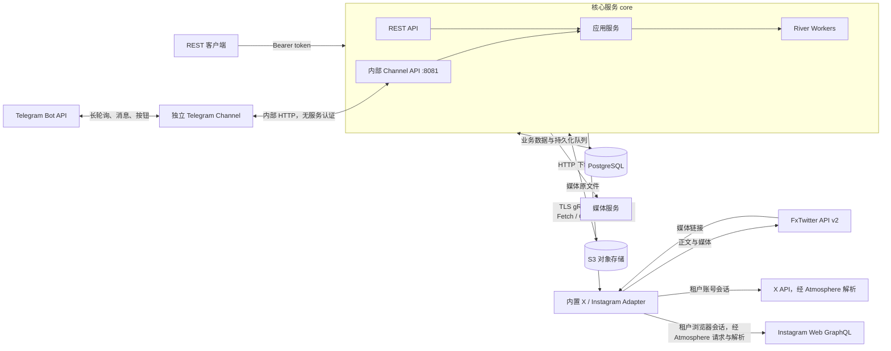
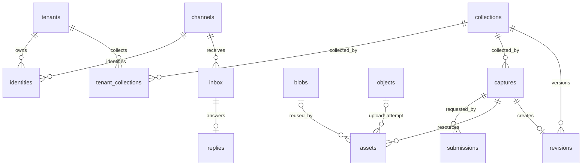

# 服务架构与数据库

## 服务组成

Monitor 由 Go 核心服务、可选 Telegram channel、Node.js/TypeScript X 与 Instagram Adapter、PostgreSQL 和 S3 兼容对象存储组成。Web、REST 和 channel 共用 core 的采集、收藏、权限和额度逻辑。

| 组件           | 当前职责                                                                                                                     |
| -------------- | ---------------------------------------------------------------------------------------------------------------------------- |
| `core`         | Web/REST、内部 Channel API、租户认证、任务调度、下载、去重、收藏与额度                                                       |
| `telegram`     | 可选渠道进程：长轮询、命令解析、文字与按钮展示、媒体投递；仅连接 core HTTP 和 Telegram                                       |
| `adapter`      | 提供 gRPC 接口，分别在 9091 / 9092 提供 X / Instagram gRPC，X 通过匿名来源或租户账号、Instagram 仅通过租户账号获取正文与媒体 |
| PostgreSQL     | 保存身份、收藏、任务、资源索引、用量和 River 队列                                                                            |
| S3             | 保存媒体二进制；本地部署使用 SeaweedFS                                                                                       |
| `migrate`      | 一次性执行数据库迁移并配置业务数据库角色                                                                                     |
| `storage-init` | 本地对象存储初始化：创建 bucket 并验证访问                                                                                   |

Adapter 是运营者部署并认证的可信服务，Provider 和其返回的资源链接按可信输入处理。Adapter 不连接数据库或对象存储；核心负责下载和持久化。用户请求及按钮参数需要身份、权限、URL 范围和额度校验。

`fxtwitter` Provider 直接调用 FxTwitter 公共实例的 `/2/status/{id}`，无需任何账号；可选 `x-session` Provider 使用指定租户的账号会话，经固定源码版本的 Atmosphere 请求并解析 X。Provider 选择持久化在任务中；收藏记录来源和 adapter 版本。视频和 GIF 选择 最高分辨率、同分辨率最高码率的 MP4／WebM 下载；文章及缺失媒体会明确标记，限流和暂时不可用会重试。

Instagram Adapter 使用独立 ID `instagram`，仅提供 `instagram-session`（个人账号）Provider，不执行匿名请求，采集内容沿用私有内容的账号访问校验，账号原始响应仅本人可见，实体类型为 `instagram.post` 与 `instagram.profile`。标准容器通过 `adapters/server.mjs` 管理两个进程，core 通过 `BUNDLED_ADAPTER_ADDRESSES` 自动发现第二个服务；其他 Adapter 继续由数据库配置注册。

Instagram 使用固定版本 Atmosphere 的纯解析器，Adapter 的请求级 transport 管理 Cookie、取消、响应大小、原始响应及错误。无全局账号池。匿名 HTML 的原文以 `{ "html": "原文" }` JSON 包装保存；JSON 接口保留原始响应字节。账号选择持久化，先尝试匿名来源，受限时通过 `credential-required` 获取该连接的凭据。账号原始响应始终私有；账号读取成功不足以证明内容公开。只有匿名采集成功的帖子进入一分钟公开时间线缓存（最多 1000 条），缓存不包含个人账号响应。轮播媒体按子媒体 ID、画质生成缓存键，头像按完整 URL 生成缓存键。来源状态无法确定时不报告删除。

Profile 将 handle 规范化为稳定用户 ID，后续采集按 ID 查询并更新主页链接；旧 handle 只作为经 ID 校验的公开查询提示。每次批次连续翻页到约 100 条或末尾，最多 12 页并保留完整末页；失败保留成员与当前游标，公开和账号游标带来源模式且不能混用。帖子到作者使用 `authored_by`，正文和简介提及使用 `mentions`。缺失的统计不补零，作者为上下文实体，Profile 为独立根实体。

网页保留帖子／账号两栏，默认分别查询 `entity_type=x.post,instagram.post` 和 `entity_type=x.profile,instagram.profile`；平台筛选映射为单个平台实体类型。旧单一 `entity_type` 链接继续只显示对应平台。

## 内容可见性

Provider 在 `Describe` 中声明支持的 `visibilities`，由 `Fetch` 返回实际可见性。公共 API 只返回 public。每个 Adapter 对象只保存一份内容：不论哪个租户、用哪个账号抓取，结果都成为同一收藏的历史版本，内容相同则复用版本。版本保留产生它的那次观察的可见性；账号抓取在取得明确公开证据前按 private 保存，之后同样内容被公开观察到时，该版本改为 public。刷新选择保存在 `tenant_collections`，共享收藏不能成为借用其他租户凭据的入口。

内容不属于任何租户。public 版本对所有已认证租户可读；private 版本只对执行该次抓取的租户，以及在 `access_grants` 中证明过访问权的租户可读。授权按租户和对象身份记录，与使用哪个账号无关：账号抓取成功即为抓取的对象授权；已有账号的租户保存他人已存的受限内容时，先用 `CheckAccess` 只请求帖子元数据确认可见，再复用已存内容，不下载媒体、不另存副本。授权后可读该对象全部历史版本；账号访问被拒绝时记录 `revoked_at`，此前的版本继续可读，之后他人抓到的版本不可读；授权不定期复核，只在该租户自己的抓取或 `CheckAccess` 被拒绝时撤销，之后再次成功即恢复。版本内嵌的非公开对象记录在 `revision_access_requirements`，租户需同时具备这些对象的访问权（或其已有公开版本）才能读取。额度仍按保存者计算，只计入该租户可读的版本。删除没有保存记录的租户（`monitorctl tenant-delete`）不影响他人可读的内容。

公开收藏的当前版本指针全局共享，任意租户刷新成功后，所有保存者查看时得到新版本；已发送的 Telegram 内容消息不改写，也不向其他保存者广播。`tenant_collections` 记录各租户自己的保存记录。任务查询仅对执行租户或提交者开放。受限函数 `capture_deliveries` 让执行租户调度该任务各提交来源的投递，不开放其他租户的身份或会话数据。

对 `tenant_collections` 按 `collection_id` 计数可得到保存该收藏的租户数；同租户不同渠道不会重复计算。全局统计需要管理员或受限统计入口，普通租户查询仍受 RLS 限制，目前没有公开保存人数 API。这里的投递指向提交者发送采集结果、文字和媒体，例如回复其 Telegram 私聊。

## 一次采集如何执行

1. 独立 channel 规范化 Telegram 消息或按钮回调，通过内部 HTTP 提交 core。core 解析租户，将输入写入 `channel_work` 并推进持久化 offset，成功后 channel 才继续轮询。REST 通过 token 摘要解析租户。
2. 应用服务规范化帖子 URL，找到或创建 `collections`。已有收藏可直接返回；同一收藏进行中的采集合并到同一个 `captures`。
3. 每次用户提交生成独立 `submissions`，记录身份、会话和幂等键。多个提交可以共享一次采集，但分别向各自来源投递。
4. 采集 worker 调用 Adapter，保存文字、媒体链接及来源信息，创建媒体下载任务。
5. 下载 worker 预留存储额度，下载并校验媒体，计算 SHA-256，上传 S3。媒体按 SHA-256 全局只存一份，任何抓取都复用已有 Blob；Blob 的读取仍需要可读的媒体引用。
6. 资源全部到达终态后才入队一次收尾任务，收藏 worker 生成内容 hash。内容有变化则写入新 `revisions`；无变化则复用原版本并更新观察时间。
7. channel 通过内部 HTTP 领取投递任务，对纯文字结果更新原状态消息；图文结果移除临时状态消息，以带说明的媒体或相册发送。已确认的消息和媒体批次进度经 HTTP 写回 core，供重试和重启后恢复。

核心使用 PostgreSQL 中的 River 队列，业务变更与任务入队在同一事务提交。远程 HTTP、gRPC 和 S3 请求不占用业务事务。

| River 队列 | 任务                   | 默认 worker 数 |
| ---------- | ---------------------- | -------------- |
| `capture`  | 调用 Adapter 采集      | 4              |
| `download` | 下载媒体、上传对象存储 | 8              |
| `control`  | 关联内容调度、完成收藏 | 4              |

采集另外受每租户 2 个执行槽、每 Connection 默认 1 个执行槽限制，分别由 `tenant_concurrency` 和 `connection_concurrency` 配置。Connection 执行槽被占用时，采集先在原地等待最多 2 秒，仍未轮到才延后重试。Provider 声明 `credential.deferred` 时，核心先不带凭据、不占执行槽调用 Fetch；Adapter 确实需要账号时以 trailer `credential-required` 拒绝，核心取得执行槽后带凭据重新调用。下载受下载 worker 数限制。可重试采集失败最多执行 3 次；限流响应的 `Retry-After` 控制下一次重试时间。channel 使用 `channel_work` 持久化租约和延后重试，每 25 秒续租，租约 90 秒到期。

## 数据库关系

租户业务表都包含 `tenant_id`；图中省略了部分租户归属关系。UUID 用作内部 ID，平台对象 ID 和外部用户 ID 使用字符串。

### 身份与访问

| 表            | 作用与关键约束                                                                                                                     |
| ------------- | ---------------------------------------------------------------------------------------------------------------------------------- |
| `tenants`     | 租户及额度配置。保存 `reserved_bytes`、`quota_bytes` 和每分钟采集计数；实际用量从保存记录的引用计算                                |
| `channels`    | Bot 等渠道实例。保存稳定 UUID、渠道类型、外部实例 ID 和 `next_offset`；`(kind, external_id)` 唯一                                  |
| `identities`  | 渠道用户与租户的绑定。`(channel_id, external_id)` 唯一；一个租户可有多个身份，同一 Telegram 用户的各 Bot 身份共享租户              |
| `tokens`      | REST token 的 SHA-256 摘要、租户和撤销状态                                                                                         |
| `connections` | 已存在的账号接入模型：租户、Adapter、Provider、账号标识、状态和凭据引用；个人账号由管理 CLI 导入、检查及撤销，凭据引用指向加密记录 |

Telegram 交互会在 `identities` 保存发送者的 `first_name`、`last_name` 和 `username`，后续交互同步改名或清空的用户名；按钮交互取点击者资料，已有用户在下一次交互时补齐。

首次 Telegram 私聊或群聊请求按发送者的 user ID，通过数据库函数 `resolve_identity` 创建个人租户与身份。事务锁保证并发首次访问不会创建多个绑定。Telegram 渠道只按用户 ID 区分用户：同一用户经不同 Bot 进入时，在新渠道补建身份并绑定到已有租户，锁按用户 ID 而非渠道获取，并发首次访问也只得到一个租户；其他渠道类型中的相同外部用户 ID 不会自动关联。群 ID 仅作为回复目的地，不作为身份。群内按钮操作还会校验原消息的发起身份，不能通过点击他人的按钮访问或更改其数据。「我也要存」是唯一例外：仅对公开收藏添加当前点击者的 `tenant_collections` 引用，在租户锁和收藏行锁内校验额度，不创建采集或提交记录，成功、重复和失败仅通过 callback toast 返回。

`channels` 是全局实例配置；`identities` 是租户数据。身份解析和 token 认证通过受限的数据库函数完成，之后的业务事务设置 `app.tenant_id`。

### 收藏与采集

| 表                   | 作用与关键约束                                                                                                                                                                                     |
| -------------------- | -------------------------------------------------------------------------------------------------------------------------------------------------------------------------------------------------- |
| `collections`        | 帖子的长期身份与当前版本指针。唯一键为数据共享边界、平台、访问作用域、对象类型、平台对象作用域、外部 ID                                                                                            |
| `captures`           | 一次采集执行，保存 Provider、Connection、状态、暂存内容、预留用量、错误和最终版本引用。相同收藏、Provider、Connection 最多一个进行中的采集；公共 Provider 跨租户合并，账号任务不跨 Connection 合并 |
| `revisions`          | 内容版本。保存内容 hash、文字等 JSONB 内容、内容字节数及产生该版本的采集 ID                                                                                                                        |
| `tenant_collections` | 租户独立的保存记录；`(tenant_id, collection_id)` 唯一，列表和游标按保存时间排序                                                                                                                    |
| `submissions`        | 一次提交及其投递。保存发起身份、渠道、会话、幂等键、状态消息 ID、状态文字和投递进度；`(tenant_id, idem_key)` 唯一                                                                                  |

**收藏是“这条帖子”，采集是“一次抓取”，提交是“谁请求了它”。** 因此多个渠道用户可以共享收藏与采集结果，同时各自收到回复。重新抓取创建新的采集记录；只有内容变化才增加版本。

`captures.state` 包括 `queued`、`downloading`、`complete`、`partial`、`failed`。失败不删除旧版本，也不表示原帖已被删除。

`collections.current_revision` 指向当前版本，`captures.revision_id` 指向该次采集最终使用的版本。投递按后者读取，避免较晚的重新抓取改变此前提交的回传内容。

### 媒体与对象

| 表        | 作用与关键约束                                                                |
| --------- | ----------------------------------------------------------------------------- |
| `assets`  | 某次采集中的媒体引用，保存顺序、来源 URL、下载状态、失败原因和 Blob／对象引用 |
| `blobs`   | 去重后的媒体内容，保存 SHA-256、对象 key、大小和 MIME；`hash` 唯一            |
| `objects` | S3 对象的生命周期记录，状态为 `pending`、`attached`、`garbage` 或 `deleting`  |

媒体字节放在 S3，PostgreSQL 保存索引和元数据。新对象 key 形如 `objects/<object_id>`，此前上传的对象保留原 key。对象回收不区分租户。

先记录待上传对象，再执行上传和落库。内容重复时复用已有 Blob，多余对象标记为垃圾；垃圾对象超过 `config.object_gc_grace_hours` 指定的最小存活时间后清理（默认 24 小时）。这样可以处理上传成功但数据库提交前进程中断的情况。

资源下载完成后先计算 SHA-256，在同一可见性及访问作用域的 hash 锁下检查 Blob；已有内容直接复用，仅不存在时上传 S3。上传期间不持有数据库事务。上传成功但数据库提交中断的临时对象仍由延迟清理机制回收。不可变媒体缓存也按访问作用域隔离。

X 视频缓存键包含媒体 ID 和具体画质路径。X 头像仅对 `https://pbs.twimg.com/profile_images/<图片ID>/<文件名>` 生成完整 URL 缓存键，保留尺寸和查询参数；Adapter 对 `_normal` 头像探测原图是否存在，已确认存在的原图地址在内存中保留（最多 5000 条），不重复探测；URL 相同则复用原文件，URL 改变重新下载并按 hash 去重。其他来源的头像不采用 URL 缓存。

旧版本通过 `revisions.capture_id` 找到对应 `assets`。媒体顺序属于引用，内容 hash 属于 Blob；不同版本可以引用同一份媒体。物理存储按 Blob 去重，租户用量按其保存记录的引用分别计算。

API 的 `used_bytes` 由 `tenant_usage()` 在当前租户 RLS 上下文中计算：已保存收藏的全部历史版本内容字节数，加上这些版本引用的媒体按 SHA-256 去重后的字节数。版本大小按规范 JSON 序列化的字节数计算。`reserved_bytes` 是执行中任务的临时预留，已下载媒体保留实际新增引用的预留，直到收藏终态统一释放。索引、队列、提交记录、备份及等待清理的重复上传对象不计入逻辑用量。

例如 A、B 都保存 10 MiB 媒体，两人的额度分别计入 10 MiB，S3 只存一份。A 删除后释放自己的额度，B 保持计量。删除一条保存记录不会释放仍被同租户其他保存记录引用的媒体。新增保存记录时，在同一事务中检查去重后的用量，不足则整体回滚。共享更新对所有保存者立即可见并计量；被动更新导致超额时保留内容，阻止新增保存与主动采集，允许读取和删除。

每个 Blob 另有一份缩略图，记录在 `blob_thumbnails`，供列表、相册和头像显示。资源就绪或复用已有 Blob 时入队 `thumbnail` 任务（`download` 队列），维护任务每轮再为至多 2000 个尚无记录的 Blob 补入队，优先级低于下载。任务用镜像内的 ffmpeg 取第一帧，短边缩到 400px、长边不超过 1200px，不放大；优先输出 WebP，ffmpeg 不带 libwebp 时输出 JPEG；视频得到的是封面帧。缩略图对象以垃圾状态登记，写入记录时才转为已附加，任务中断不会留下孤儿对象。无法渲染的文件记为 `failed` 不再重试；没有 ffmpeg 时不入队也不记录。缩略图是派生数据，不属于任何租户，也不计入用量；Blob 删除时记录级联删除，触发器把对象转入垃圾清理。`GET /v1/assets/{id}/thumbnail` 的访问规则与原图相同，资源的 `thumbnail` 字段表示缩略图已就绪，未就绪时网页回退为原图或视频。

删除通过 `DELETE /v1/collections/{id}` 或 Telegram `/delete` 执行。最后一个引用删除时记录 `unreferenced_at`。维护任务在 `config.collection_retention_days` 天后（默认 7 天）锁定并检查收藏，无保存记录、在途采集或待发送结果时删除内容索引；只有没有其他资源引用的 Blob 才转入对象垃圾清理。重新保存会清除清理标记。保存、用量检查和删除使用租户锁；内容清理与重新保存使用同一收藏行锁。

### 渠道与基础设施

| 表                  | 作用                                                                                         |
| ------------------- | -------------------------------------------------------------------------------------------- |
| `inbox`             | 持久化 Telegram 消息及按钮回调；`(channel_id, update_id)` 唯一，防止重复消费                 |
| `replies`           | 命令回复的文本、按钮、消息 ID 和发送状态；每个 inbox 最多一条回复                            |
| `config`            | 全局运行参数和服务凭据，保存键、文本值、值类型、敏感标记和更新时间；管理员写入，业务角色只读 |
| `schema_versions`   | 应用 schema 版本标记，发布前保持 `1`                                                         |
| `schema_migrations` | 已执行迁移的文件名、校验和与执行时间；管理员访问                                             |
| `river_*`           | River 管理的任务、队列、调度和迁移记录                                                       |

业务表启用并强制执行 RLS。身份、Connection、保存记录、访问授权、提交与消息按租户隔离；收藏、实体和 Blob 的身份行对已认证租户共享，版本、媒体引用、实体版本和关系按版本可读性控制，由 `SECURITY DEFINER` 函数 `tenant_can_read_revision` 判定；账号原始响应只对执行抓取的租户可读。核心的 `monitor_app` 角色无超级用户、表所有者或 `BYPASSRLS` 权限。River 表是内部共享调度数据，由核心访问；用户通过业务 API 查询自己的任务。

## Telegram 消息处理

群聊的触发消息 ID 持久化在 `submissions.reply_to_message_id` 和 `replies.reply_to_message_id`。发送文字、媒体、媒体组或文件回退时均带回复目标，进度编辑保留已有回复关系。按钮操作在群内新发消息，并回复被点击的 Bot 消息。

命令定义集中在 `internal/app/commands.go`。同一注册表驱动命令处理、参数校验、帮助文本、按钮回调校验及 SDK `setMyCommands`。启动时自动同步菜单。

消息 ID 和按钮写入数据库。状态更新与最终投递共享提交级锁，避免进度消息覆盖结果；从采集状态或已完成的收藏消息打开菜单时，导航回复使用独立消息，保留收藏内容；菜单及状态查询消息可以原地更新。单个媒体的正文优先放入说明，限制为 1,024 个 UTF-16 单位，按钮附在媒体消息上；多个媒体每组最多 10 个，所有媒体批次先发送，再独立发送正文和按钮，避免相册不显示按钮。媒体发送失败时可回退为文件，保留说明与回复目标。媒体发送、正文和按钮投递、溢出文字分别记录进度，正文或按钮投递失败后重试不会重发已确认的媒体。多媒体投递以第一条正文消息 ID 关联按钮权限。

Telegram 投递采用至少一次语义：远端成功但响应丢失时可能重复展示，收藏与额度更新保持幂等。

## 代码入口

- `cmd/core/main.go`、`internal/runtime/`：核心进程与依赖装配。
- `cmd/telegram/main.go`、`internal/tgchannel/`：独立 Telegram HTTP 客户端和展示逻辑。
- `internal/channelapi/`、`internal/httpapi/channel.go`：内部协议与专用监听器。
- `adapters/x/src/server.ts`：TS X Adapter 进程。
- `internal/app/`：业务服务、采集任务与渠道业务动作。命令解析、消息排版、按钮和 Telegram 投递均由 `internal/tgchannel/` 执行；core 不依赖 Telegram SDK，也没有旧渠道 worker 或 `Sender`。升级兼容仅保留旧队列数据的读取、凭据重加密和确认。
- `internal/telegram/`：Telegram SDK 封装。
- `internal/store/migrations/0001_initial.sql`：表、约束、RLS 与身份解析函数。
- `api/adapter/v1/adapter.proto`：Adapter 协议。
- `adapters/x/src/session.ts`：租户账号 transport 与结果可见性判定。
- `adapters/x/src/`：公共 API 与个人账号 Provider；`third_party/atmosphere/`：固定上游版本的本地源码依赖。

媒体引用保存 `kind`、`alt_text` 和 `cache_key`。缓存键由平台和不可变媒体标识组成，不含访问作用域：Adapter 为本次抓取列出该媒体，说明执行账号已能看到这些字节；标识包含媒体 ID 与文件规格。下载使用媒体级锁合并并发请求，命中缓存后复用 Blob 并按当前租户引用结算额度。媒体描述计入版本内容大小及变化比较，描述变化不会触发视频重新下载。缓存随媒体引用的保留和清理生命周期释放。

群聊普通消息在入库和身份解析前检查 Telegram 的 mention／bot_command 实体，只有明确指向当前 Bot 用户名的消息才进入处理；图片说明中的 @ 同样适用。按钮回调沿用原权限规则，不要求再次 @。用户名通过启动时的 getMe 获取。

`channel_media_cache` 是通用渠道传输缓存，以 `(channel_kind, account_id, hash, representation)` 标识远端媒体引用 `remote_id`。这些值由渠道集成解释，收藏和 Blob 不依赖 Telegram；缓存不是内容授权依据，发送前仍使用当前用户可访问的收藏。Telegram 按 Bot ID 复用 `file_id`，并区分 photo、video、document。仅明确失效的引用会被条件删除并重新上传，429 等暂时错误不会清除缓存；成功发送后的缓存写入失败也不会重发消息。

媒体引用上的 `sensitive` 由 Adapter 返回并计入版本比较。FxTwitter 的帖子敏感标记应用到全部媒体；Telegram 每次发送（含缓存命中）都使用当前引用的标记设置 `has_spoiler`。缓存键不包含敏感标记，改变展示标记无需重新上传。document 文件正常发送，不设置 spoiler；图片和视频发送失败时仍可回退为文件。

## 账号执行与凭据

`account_credentials` 保存 AES-GCM 密文，AAD 绑定租户和凭据记录 ID；`tenant_preferences` 以 `(tenant_id, adapter_id)` 为主键，分别保存每个 Adapter 的默认 Connection，并用包含租户和 Adapter 的外键约束账号归属。两张表均强制 RLS。主密钥由部署环境或 secret 文件提供，不写入数据库。

核心解密后通过认证 TLS RPC 临时传递凭据。Adapter 不保存租户会话，不使用账号池，不匿名降级；公开 API 请求不携带账号凭据。任务记录 Provider、Connection 及实际执行的凭据修订号，执行和最终提交均校验状态；凭据替换或撤销使旧执行不能提交结果。认证失效标记 `reauth_required`，限流和临时上游故障不改变认证状态。

个人账号导入需验证会话；验证失败不会替换已保存凭据。撤销会删除不再引用的加密凭据，但保留 Connection 的任务审计关联。新账号功能的真实受保护帖子访问需要使用已授权的测试账号完成验证。

## Adapter 协议与能力发现

`adapter.v1` 使用 `major.minor` 协议版本，当前为 `1.0`，与 Adapter 软件版本独立。核心拒绝不同 major；同 major 的 minor 只能增加可选字段和操作，旧客户端忽略未知字段。发布后改变已有字段含义、删除字段或改变现有操作语义需要新的 major 和 protobuf package。发布前不保留旧协议的兼容分支。

`Describe` 是唯一必需的业务 RPC；标准 gRPC health 用于部署健康检查。核心握手不限定平台 ID，也不要求支持采集、账号或某一种媒体。每个 Provider 独立声明 `capabilities`，每项含 `name`、`major`、`minor`：

| 能力                  | 当前版本 | 含义                                                                                                          |
| --------------------- | -------- | ------------------------------------------------------------------------------------------------------------- |
| `capture.fetch`       | 1.0      | 用 `Resolve` 规范化 URL，再用 `Fetch` 读取单个目标                                                            |
| `capture.related`     | 1.0      | 返回关联目标及最小刷新间隔；核心按提交者身份持久化执行有界关联采集                                            |
| `capture.page`        | 1.0      | `Fetch.page_cursor` / `next_page_cursor` 为不透明分页游标；沿用原 Provider、Connection，空返回表示末页        |
| `capture.canonical`   | 1.0      | Fetch 返回同平台、同类型的稳定目标身份                                                                        |
| `capture.access`      | 1.0      | 用 `CheckAccess` 单次上游请求确认账号仍可读取目标及内嵌对象；错误语义同 Fetch                                 |
| `credential.prepare`  | 1.0      | 用 `PrepareCredential` 将用户输入转换为 Adapter 私有的凭据格式                                                |
| `credential.deferred` | 1.0      | `Fetch.credential_deferred` 表示凭据暂未提供；需要账号时以 trailer `credential-required` 拒绝，核心带凭据重试 |
| `connection.check`    | 1.0      | 用 `CheckConnection` 验证账号会话                                                                             |
| `content.text`        | 1.0      | 采集结果可以包含文字                                                                                          |
| `entity.graph`        | 1.0      | 返回由 Adapter 声明结构的实体及关系                                                                           |
| `source.raw`          | 1.0      | 完整上游响应体及其可见性                                                                                      |
| `media.image`         | 1.0      | 采集结果可以包含图片                                                                                          |
| `media.video`         | 1.0      | 采集结果可以包含视频                                                                                          |

能力表示 Provider 可以提供的功能，不保证每次结果包含所有媒体。实际收藏内容仍以 Fetch 返回的数据为准。公共 FxTwitter Provider 不声明账号验证能力；个人账号 Provider 声明该能力。采集 Provider 同时声明允许的可见性，实际结果仍须遵守公私隔离规则。`CheckAccess` 不重新采集内容，只返回目标可见性及请求中目标和内嵌对象里账号可读的子集；声明 `capture.access` 的 Provider 在 Fetch 的 `restricted_targets` 中列出图中缺少公开证据的内嵌对象，公共 Provider 留空。

调用方按能力名称、相同 major、满足最低要求的 minor 选择操作；未知能力或未知能力 major 不阻止握手，也不会自动启用操作。一个能力 major 只能声明一次，需要支持多个 major 时分别声明。缺少操作能力时核心在提交或发送凭据前拒绝请求。声明了能力但实际返回 `UNIMPLEMENTED` 属于契约错误，按永久失败处理，不切换 Provider。

未来检索、批量读取、流式订阅分别增加 RPC 和独立能力声明，现有 Adapter 无须实现。新操作的权限范围、分页或批量上限、流的取消与背压、断线恢复游标需随该操作的契约一起定义；不能仅增加能力名称就视为支持。Go Adapter 可嵌入 `UnimplementedAdapterServer`；TypeScript 实现使用 `satisfies Pick<AdapterServer, "describe"> & Partial<AdapterServer>`，缺少的方法由 gRPC 返回 `UNIMPLEMENTED`。核心通过 Adapter 的 `Resolve` 获得平台、实体类型、对象作用域、字符串 ID 和规范化 URL，不解析平台 URL。核心可同时连接多个 Adapter，按 Describe 声明的 host 路由 URL；重复 Adapter ID 和重叠 host 配置在启动时拒绝。账号选择以租户和 Adapter 为联合键，各平台独立生效。任务持久保存 Adapter ID，重试不重新路由；Provider ID 只在所属 Adapter 内解释。

Adapter 在 `Describe.display_name` 声明展示名称；未提供名称时显示其 ID。界面不维护平台 ID 与名称的映射。

Provider 通过 `default_provider` 声明各认证模式的默认选择，同一认证模式只能有一个默认项。任务和 Connection 保存实际 Provider，执行时校验 Adapter 归属及能力，不隐式替换。凭据格式说明由 `credential_help` 提供。网页添加表单和 Telegram 的“添加账号”入口按 Adapter 能力启用。

Describe 声明在核心启动时验证并缓存，能力变化需重启核心重新发现；管理 CLI 每次操作重新发现。滚动升级应先部署提供兼容旧能力的 Adapter，再升级核心，最后停用旧能力；跨 major 升级需并行部署对应版本端点。

账号在网页添加：`POST /v1/accounts` 在请求内同步通过 TLS 调用 Adapter 的 `PrepareCredential` 解析并规范化，再用 `CheckConnection` 验证，成功后才加密写入 `account_credentials`；凭据输入不进入队列，也不写日志。Go 核心只处理不透明字节、加密和归属校验，不解析 Cookie 字段。`GET /v1/accounts` 列出各 Adapter 的公共来源、可添加状态、凭据说明和账号（不含凭据），`PUT /v1/accounts/selection` 切换来源，`DELETE /v1/accounts/{id}` 撤销账号。Telegram 渠道不接收凭据：`/account_add` 只回复网页入口，命令后附带的内容仅作为删除原消息的信号，不进入 `channel_work`。旧版本队列中的账号导入数据会丢弃暂存密文并回复网页入口。

X 账号验证使用携带该账号 Cookie 的 `Viewer` GraphQL 接口，从当前会话返回的用户实体确认账号 ID 和用户名。普通帖子和 Profile 查询直接请求 API，不依赖登录首页或请求签名。只有上游签名清单中的接口才使用该账号首页初始化签名，账号页面不进入共享缓存。浏览器验证挑战、认证拒绝、受限会话、响应结构变化和上游临时故障分别处理；未知响应不视为验证成功，也不会自动回退为访客或其他账号。

## 数据库迁移

`schema_migrations` 保存有序迁移文件名、SHA-256 校验和及执行时间，仅管理员访问。迁移进程持有 PostgreSQL advisory lock，先校验全部已执行历史，再按顺序应用未执行文件；每个文件的 SQL 和执行记录在同一事务内提交。完整初始结构只执行一次，后续通过独立迁移变更结构和数据。River 维护自己的迁移记录，与应用 schema 版本独立；应用迁移和 River 升级均成功后才允许启动核心。

## Adapter 定义的实体与原始响应

Adapter 的 `Describe.entity_types` 提供类型名与自包含 JSON Schema 2020-12。Provider 通过 `entity.graph` capability 和 `entity_types` 列表声明所支持的类型。核心在发现阶段编译 Schema，在采集阶段校验实体数据、根节点、关系端点和资源索引；未声明的类型或不符合 Schema 的数据不会入库。协议保持 `1.0`、应用 schema 保持 `1`。类型结构变化通过各版本保存的 Schema 快照区分，不由公共 proto 定义平台字段。

`Fetch.graph` 包含 root、entities、relations。每个实体有图内 key、类型、外部 ID、JSON data 和资源索引；关系使用图内 key 与 Adapter 定义的关系名称。整张图继承采集结果的可见性与访问作用域，不能从图内引用其他租户或作用域的已有实体。资源的 purpose 由 Adapter 定义：空值表示加入通用展示，其余作为实体关联资源保存。核心只认识通用媒体类型，不解释 avatar 等角色。

`entities` 以平台、类型和外部 ID 标识对象，全局只有一份；实体版本的数据只能通过可读的收藏版本读取。`entity_versions` 保存数据、Schema 快照与内容哈希；实际资源内容参与版本比较。`revision_entities` 将收藏版本关联到当时的实体版本，并标记根节点；`entity_relations` 保存该次快照的关系。`GET /v1/entities/{id}` 读取调用租户所保存收藏关联的最新实体快照；收藏 API 内的 graph 固定关联当时版本。

X Adapter 在 `adapters/x/src/entity-schemas.ts` 定义 `x.post` 和 `x.profile`，通过 `authored_by` 关联。转发使用 Profile 到原帖的 `reposted` 关系；单帖中的引用和转发分别使用帖子到原帖的 `quoted`、`reposted` 关系，并独立采集原帖。详情页显示关联摘要，优先链接已保存的原帖；帖子正文与作者简介中的提及使用 `mentions` 指向 Profile，并调度关联资料采集。时间线保留转发关系，同时单独采集原帖。实体图最多包含 512 个实体、1,024 条关系，仍受 2 MiB 大小限制。帖子 data 包含正文、上游发布时间、编辑时间及来源、编辑 ID 列表；Profile data 包含用户名、昵称、头像 URL 与个人资料。头像文件由 Adapter 作为关联资源返回，核心下载保存，不加入 Telegram 帖子相册。编辑时间优先采用上游明确字段，否则在存在多个编辑版本 ID 时从最新 Snowflake 推导并标记 `x_snowflake`；没有证据时省略。

Fetch 的 text、text_kind、summary、author_name、published_at 和展示媒体是可选的通用展示字段，与 entity data 分开。summary 由 Adapter 提供；X Adapter 使用“作者名：内容”，并按帖子媒体顺序追加 `[图片]`、`[视频]`，不包括作者头像。Telegram 列表将换行合并为空格，每条最多显示 100 个字符，超出用省略号收尾并保留媒体标记，条目间留空行。列表摘要以文本链接指向收藏的来源 URL。每行按钮并排提供查看收藏和查看原帖。详情展示收藏 ID、作者、正文和原始发布时间，来源通过原帖按钮打开；时间转换为 UTC+8，未知时间省略。Telegram 只读取这些字段，不解析 X 或其他平台的专属 JSON。正文和摘要在同一收藏版本中保存。

`related_to` 仅按收藏根实体的直接关系筛选：候选收藏当前根实体直接指向目标根实体，或目标收藏已保存历史中的根实体直接指向候选根实体。作者简介里的提及、引用帖作者和没有关系边的上下文实体不构成候选帖与目标资料的关联。关系类型由 Adapter 定义，不限定平台；筛选结果的 `relation_types` 与占用统计使用同一直接关系判定，并保留跨来源作用域身份、已解析别名与历史转发关系。

收藏详情与历史版本详情另附 `incoming_relations`（关系类型、来源实体及可选作者），从调用租户仍保存的历史快照中查询 `reposted`、`quoted` 传入关系。目标按平台、实体类型和外部 ID 跨来源作用域匹配；来源按稳定身份和关系去重，采用该租户可读、已保存的最新实体资料，并在读取时解析 `saved_collection_id`。作者从该来源快照的 `authored_by` 关系解析，作者内链也限制为当前租户的收藏。此视图不修改历史 `graph`，未保存的公开来源和其他租户的私有来源均不参与。

读取收藏时，图中被 `authored_by` 指向的实体（根实体除外）另附 `current`：该租户可读的最新完整版本，即曾作为某个版本的根实体或根实体作者被采集的版本；引用帖作者等只带名字的副本不算。只有与快照版本不同时才附带，内容为版本 ID、data 和头像。Web 默认按 `current` 显示作者名、用户名、头像和锁推状态，帖子详情可切换回抓取时的资料。收藏本身所属的实体不替换，历史版本仍按当时显示。锁图标跟随作者资料的 `metadata.protected`，只有资料从未记录该字段时才回退为收藏可见性。

`source_responses` 保留采集接口响应体的原始字节、内容类型、请求地址、哈希、大小和采集记录关联，不保存请求 Cookie、认证头或登录首页。每次成功采集都保存原始响应，即使实体内容没有变化；原始响应变化不会单独创建内容版本。账号接口的原始响应强制为私有，不能随公开帖子向其他租户共享。其读取需要原始采集租户仍保存该帖子；删除后独立进入保留期，即使公开帖子仍被其他租户持有，也能回收该私有响应。

逻辑额度包含收藏版本序列化内容（包括 entity data、Schema 快照和关系）、唯一媒体文件和可访问的原始响应字节。实体索引表不重复收费；数据库索引、队列等运行开销不计入。原始响应单次合计上限 4 MiB，完整响应过大时明确失败，不静默截断。

`20260928000000_adapter_entities.sql` 将既有帖子与 Profile 快照转换为通用实体，保留收藏及作者实体 ID、内容历史、资源和原始响应，转换执行中的采集快照并调整预留用量。旧 Profile 专用表转换后删除，运行代码不保留旧协议或数据格式分支；初始迁移的内容和校验和不变。

采集提交分别保留用户输入的原始链接（包括参数），不会因 URL 规范化或任务合并而覆盖。Telegram 失败通知使用对应提交的输入；旧提交优先从尚存的 inbox 恢复，无法恢复时使用收藏来源 URL。较长的命令回复分段发送并持久化进度。账号采集使用私有暂存身份，但刷新已有收藏不会把暂存身份自动加入保存列表；结果可见性确定后才关联最终收藏。

账号以租户、Adapter、Provider 和上游验证返回的账号 ID 去重。重复添加替换凭据、刷新 handle 并递增凭据版本，保留 Connection ID，并选中该账号。

### 关联目标和 Profile 采集

`Resolve.refresh_on_submit` 表示显式提交需要重新观察目标。`Fetch.canonical_target` 将用户名等临时定位方式归一为稳定身份；根实体 ID 对应最终身份。`Fetch.related_targets` 返回关联 URL 和 `refresh_after_seconds`，正值表示完成观察超过间隔后才刷新，零表示复用已有收藏。Go 核心不解释平台路径或 Profile 字段。

每次显式提交都持久化一个关联任务及提交者的 Adapter、Provider、Connection。主采集到达终态时立即唤起该任务；提交时主采集仍在进行的，另排一个 10 秒后的兜底任务（之后每 2 秒轮询），用于其他租户执行的共享采集，任务在该租户上下文中逐一创建幂等子提交，共享主采集的其他租户使用各自的账号选择。子提交设置 `automatic`，不生成渠道投递；集合或需要显式刷新的自动目标不再展开，其他直接子提交可继续采集一层引用，引用的引用不再展开；限流时延后执行，错误记录在提交的 `related_state` 和 `related_error`。每页最多接受 512 个关联目标（包括帖子及资料引用），超限拒绝整页而非静默截断。

X Adapter 支持帖子、用户名 Profile URL 和稳定用户 ID Profile URL。帖子返回作者 Profile 的关联目标，刷新间隔为 60 秒；Profile 显式提交始终重新读取资料并连续读取时间线，将累计约 100 条帖子声明为关联目标，并返回下一页游标供用户通过「抓取更多」继续采集。公开账号使用公共实例，count=100；受保护账号使用所选采集账号，count=100。自动 Profile 采集只读取资料。Profile 资料始终使用 FxTwitter 公共 API，包括 protected 账号；即使用户选择了账号，公开帖文仍使用公共 API，只有受保护帖文使用该 Connection 的 Cookie。完整响应体保存在 `source_responses`，账号原始数据不随公开资料共享。公开时间线列出的帖子与单帖接口返回的内容相同，Adapter 在内存中保留 30 分钟（最多 2000 条），核心随后自动采集这些帖子时直接使用，不再逐条请求，作者也采用列表条目中的资料（不含 `about_account`，头像统一为 `_normal` 地址后再探测原图），不再请求资料接口；其原始响应记录为列表中的该条目，请求地址为所在的时间线页。显式提交的帖子、带文章的帖子（列表只含空壳）、受保护时间线以及缓存过期或 Adapter 重启后的帖子仍请求单帖接口。Profile 头像和封面作为实体关联资源保存。

Fetch 失败时，Adapter 可以用 trailer `source-state` 告知来源本身已不可用：`deleted` 表示帖子已删除，`suspended` 表示账号被封禁。核心把它记录在 `collections.source_state` 和 `source_state_at`，采集仍按失败处理，已有版本不变；之后任一次成功采集会清除该标记，因为封禁可能解除。X Adapter 只依据公共帖子 API 的返回判断：`code` 404 视为删除，404 且 reason 为 `suspended` 视为封禁，401 表示帖子存在但受保护。GraphQL 接口的 404 表示查询已失效，不作为删除依据。采集账号读不到帖子时，Adapter 会先查询公共 API，确认已删除或封禁时报告该状态，而不是撤销访问授权。保存链接中的用户名查不到或已被封禁时，改按帖子 ID 查询，以处理改名的情况。

`Resolve.collection` 标记显式提交会展开关联内容的集合。集合采集的游标、下一页游标和标记保存在 captures；活跃任务按游标及自动采集标记区分，显式请求不会复用跳过展开的自动采集。Telegram 按提交者的子任务统计进度，完成后提供下一页按钮；回调只携带提交 ID，租户校验通过后由服务读取游标和账号选择。重复点击同一下一页按钮幂等，子任务仍不逐条投递。分页能力为可选扩展，协议保持 1.0。

`Fetch.page_size` 是可选目标数量，允许完整保留最后一页而超出目标。X Adapter 对公开和受保护时间线均连续翻页，累计至少目标数量（默认 100）或到达末尾；跨页去重，保留每页原始响应及最后的游标。单次最多处理 20 页，达到执行边界或部分失败时保留进度供继续抓取。`max_batch_size` 声明批量能力，公开 Profile 为 1000，受保护 Profile 不提供批量按钮。采集进度提供「中止」按钮，`submissions.collection_stopped` 持久化中止状态，`parent_submission` 记录派发关系。中止与子任务提交共用租户事务锁，阻止中止后继续派发；已提交任务完成收尾，保留已有收藏，不取消其他提交共享的采集。批量任务用 `submissions.next_submission` 持久化页面链，每页仍独立请求和重试；`collection_limit` 保存剩余条数，子任务不单独向渠道发消息，根提交汇总整条链的进度。

## Web 收藏库与采集可用性

Vue Vapor 静态客户端由 Cloudflare Workers Static Assets 提供（不包含 Worker 脚本）；同域 `/app/*` 路由到静态资源，`/v1/*` 仍直达 core。本地开发可由 core 提供静态产物，业务页面只依赖 HTTP API；Telegram SDK 仅位于宿主层。平台展示器读取收藏实体快照，未知实体使用正文、摘要和媒体回退，不依赖 Adapter 在线。

`web_sessions` 保存随机会话密钥摘要、租户和固定到期时间。登录验证 Telegram initData 后调用原有身份解析；普通浏览器使用 Telegram Login Widget，按其规则以 Bot token 的 SHA-256 为密钥校验签名，`auth_date` 允许 24 小时内，之后同样解析为 Bot 的租户。Widget 以跳转方式回到 `/app/`，网页读取并立即从地址栏移除签名字段后提交。`GET /v1/auth/telegram` 无需登录，返回 Widget 所需的 Bot 用户名（首次调用时向 Telegram 查询并缓存）。Cookie 写请求校验 Origin。Web 会话在 RLS 之外校验收藏关系，公开内容也必须已被当前租户保存。REST Bearer 读取行为保持兼容。

Adapter 描述通过后台注册表定期发现。不可达不阻止 HTTP 读取服务启动；注册表保留最后一次有效描述，独立标记在线状态。协议、身份或重复域名等配置错误终止服务。刷新不切换原 Provider，网页可查询保存记录对应 Adapter 的可用性。

实体图的非根节点可声明 `context_only`：保留采集快照和独立实体版本，但其字段、仅属于该节点的媒体及通用展示字段 `author_name`、`summary` 不参与所在收藏的版本比较。节点身份和关系仍参与比较，根节点不得声明此标记。X 帖子的作者节点使用此标记；单独采集的 X Profile 根节点不使用，因此账号信息变化仍产生 Profile 历史版本。已有收藏在后续采集时按当前上下文规则重新比较旧快照，避免切换规则本身制造新版本；既有历史记录保留。

X Post 根实体保存上游实际提供的 `replies`、`reposts`、`likes`、`bookmarks`、`quotes` 非负整数统计，保留零值而不将缺失值补零。这些统计参与帖子历史版本比较，Web 在帖子底部展示所选版本的统计；旧快照缺少的统计不回填。

### 跨来源收藏历史

租户收藏按 Adapter 声明的 `(platform, kind, object_scope, external_id)` 归为同一个逻辑收藏；公开来源和不同账号的采集历史在列表及详情中统一展示。列表分页前去重，详情展示最新快照，历史版本保留每次采集的来源权限。相同名称不作为身份依据。底层快照仍保留各自的权限范围，合并仅包含当前租户已经保存的记录，不扩大其他租户可见范围。旧收藏链接继续可用。

标签取所有已保存来源的并集，旧备注保留不同内容；修改时同步该逻辑收藏的全部已保存来源。删除会移除当前租户对所有来源的保存引用。其他租户的收藏及历史不受影响。
